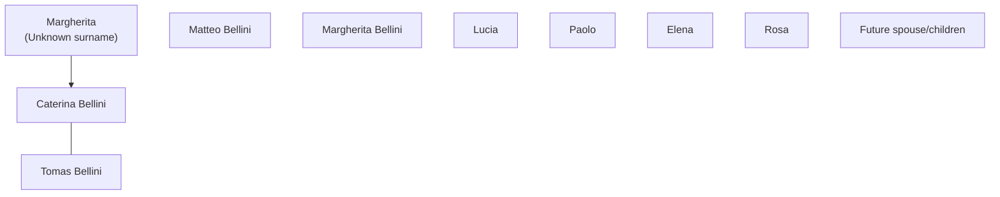

THe Bellini family tree

```mermaid
flowchart TD

%% Grandparents
GM["Margherita<br/>(Unknown surname)"]

%% Parents
C["Caterina Bellini"]
T["Tomas Bellini"]

%% Children
M["Matteo Bellini"]
MS["Margherita Bellini"]

%% Matteo's family
L["Lucia"]
P["Paolo"]
E["Elena"]
R["Rosa"]

%% Future branch
Future["Future spouse/children"]

GM --> C

C --- T
```
C --> M
C --> MS

T --> M
T --> MS

M --- L

M --> P
M --> E
M --> R

L --> P
L --> E
L --> R

MS --> Future

